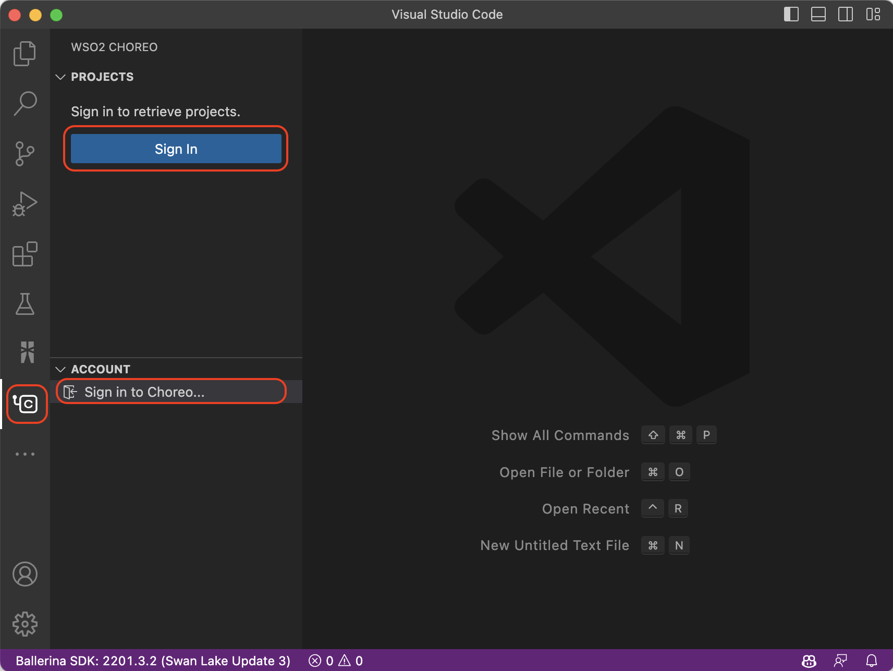
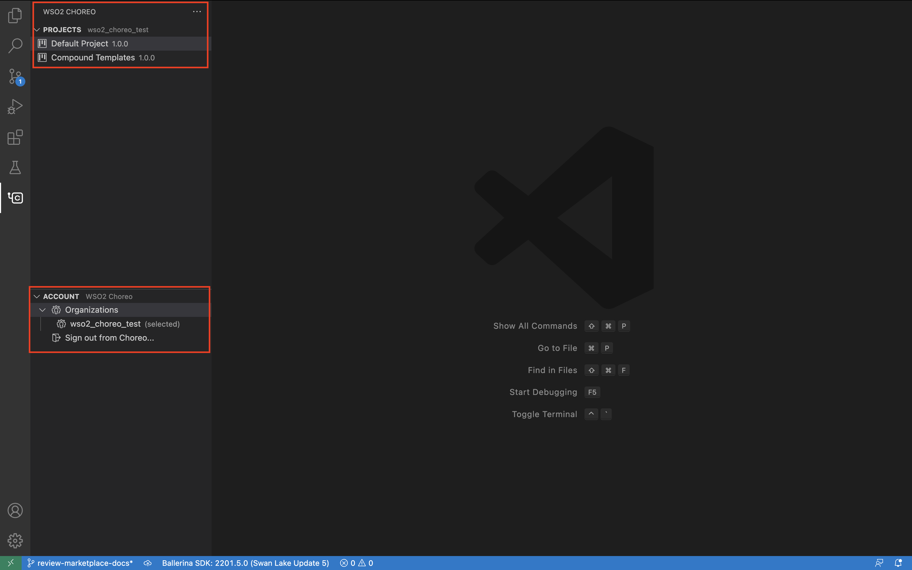

# The Choreo extension for Visual Studio Code

The Choreo VS Code extension enhances your local development experience with [Choreo projects](https://wso2.com/choreo/) by providing a wide range of project and component management capabilities. Learn more about [Choreo](https://wso2.com/choreo/docs/).

## Set up the prerequisites

Follow the steps below to configure your local environment for a seamless development experience with the Choreo extension. 

1. Install [Ballerina](https://ballerina.io/learn/get-started/#install-ballerina).
2. Install [Visual Studio Code](https://code.visualstudio.com/download).
3. Install the [Ballerina VS Code Extension](https://marketplace.visualstudio.com/items?itemName=WSO2.ballerina) version 4.0.0 or later.
4. Install the [Choreo VS Code extension](https://marketplace.visualstudio.com/) version 1.0.0 or later and wait for activation.
5. Sign in to Choreo using one of the following methods.
    - Via the `Sign In` prompt displayed upon successful activation of the extension
    - Via the `Sign In` options available by clicking the Choreo icon on the activity bar of your VS Code editor
    

>**Tip:** The above step redirects you to an external URI to complete the authentication process. If the sign-in is successful, all projects and organizations linked to your Choreo account will be visible in the Choreo activity panel as shown below.

## Create a project

Follow the steps below to create a new Choreo project directly from VS Code.

>**Info:** If you already have a Choreo project, [clone it](#clone-a-project) and proceed with the next steps. 

1. In the Choreo activity panel, click the **+** icon next to **PROJECTS** to create a new project.

    >**Tip:** Alternatively, execute the **Create new project** command in the Terminal.

2. In the **New Choreo Project** pane, complete the new project wizard by specifying appropriate values for the required fields.

    >**Tip:** If you want to use a single repo to store all the components of the project, select the **Initialize a mono repo** option, and provide a GitHub **Repository** and its **Organization**. This will redirect you to GitHub to authorize a repository to link it to the project.

## Clone the project

Follow the step below to clone your project and create a copy of it in the local environment. 

>**Tip:** If the project is already cloned, click **Open Project** and proceed with the next steps.

1. In the Choreo activity panel, select the project from the **PROJECTS** list. 

    >**Info:** This opens the **Project Overview** displaying the list of components of that project.

2. In the **Project Overview** page, click **Clone Project** to clone the repository and the project locally. 

3. Select a directory in your local machine to store the project.

4. Click **Open Project** to load it into VS Code. 

    >**Tip:** Once the project is cloned, it opens as a workspace in VS Code. Each component will be available as a workspace item. 

## Design and develop your application

Follow the steps below to design and develop your application by adding components to it.

>**Info:** This creates the sources for each component locally in the given repo, and each component will be added as a workspace item in VS Code.

1. In the Choreo activity panel, select the project from the **PROJECTS** list. 

2. In the **Project Overview** page, click **Cell View** to view the Cell Diagram.

3. In the Choreo activity panel, click **+ COMPONENT**.

4. Specify appropriate values for the required fields to create the new component.

5. Click **Next**, and then click **Create**.

6. In the Choreo Console, click **COMPONENT +** and repeat the steps above to create another component.

7. Right-click on the added components to load the **Context** menu of them, and click the **Use Internal/External APIs** links to mark the interactions between them.

## Push your changes to Choreo

Follow the steps below to push the changes to Choreo after creating the components.

1. In the Choreo activity panel, select the project from the **PROJECTS** list. 

2. In the **Project Overview** page, click **Push to Choreo** to push changes related to a component to the GitHub repository.

    >**Tip:** The **Project Overview** page indicates if a change related to a component has not been pushed to the GitHub repository.

3. Click **Open Source Control**, enter an appropriate commit message, and click **Commit** to commit the changes.

4. Click **Sync Changes** to upload the component changes to your local environment.

5. Click **Push Components to Choreo** to upload the components to the Choreo platform.

    >**Info:** Once you push the components, they will be visible on the Choreo platform. 

## Deploy your components

Follow the steps below to deploy the components after creating them.

1. In the Choreo Console, navigate to the **Component Deploy** page, and click **Deploy**. 

2. Once the components are deployed, click on the corresponding project in the Choreo activity panel. 

3. View the build and deployment status of the components on the **Project Overview** page.

## Troubleshoot

Follow the steps below to troubleshoot Choreo extension issues.

1. In the status bar at the bottom of the VS Code editor, click the option to open the **PROBLEMS** pane. 

2. Click **OUTPUT** to open the **OUTPUT** pane.

3. From the drop-down menu on the RHS, select **Choreo** to view the Choreo output for troubleshooting.

## Ask for help

Create [Github issues](https://github.com/wso2/choreo-vscode/issues) to reach out to us.
