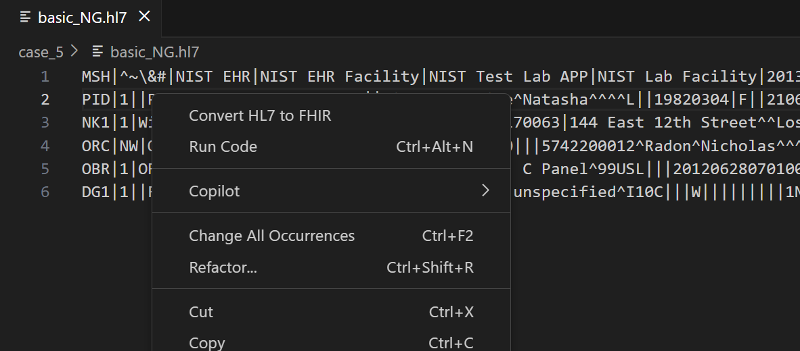
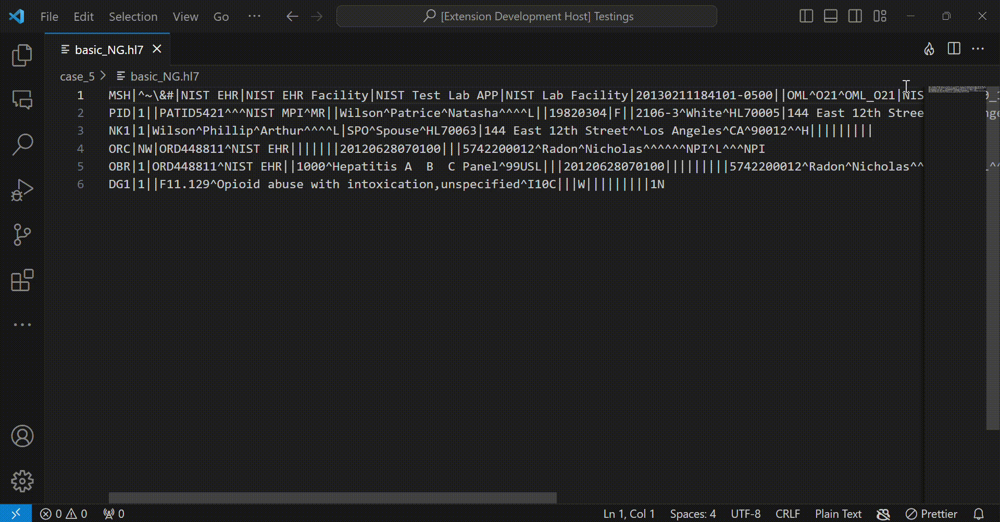

# Health Care VS Code extension

This extension is used to convert HL7 v2 messages and C-CDA messages into FHIR resources. When you trigger the conversion command, it will convert the corresponding message into a FHIR resource.

## Usage

1. Open a HL7 v2 message (either in a .txt file or .hl7 file) or an xml file containing CDA content.
2. Click the **Flame** icon to perform the conversion.
   

   **OR** 
   
   Right Click on the editor which has the content, to convert the message into a FHIR resource
   

Now, you can see the converted FHIR resource in a secondary panel. You have the option to download or copy the generated FHIR resource.

## Setting up with your own services [OPTIONAL]

1. Host your HL7v2 to FHIR conversion service either [locally](https://github.com/wso2/open-healthcare-prebuilt-services/tree/main/transformation/v2-to-fhirr4-service#setup-and-run) or in [Choreo](https://github.com/wso2/open-healthcare-prebuilt-services/tree/main/transformation/v2-to-fhirr4-service#optional-deploy-in-choreo)
2. Host your C-CDA to FHIR conversion service either [locally](https://github.com/wso2/open-healthcare-prebuilt-services/blob/main/transformation/ccda-to-fhirr4-service/README.md#setup-and-run) or in [Choreo](https://github.com/wso2/open-healthcare-prebuilt-services/blob/main/transformation/ccda-to-fhirr4-service/README.md#optional-deploy-in-choreo)
3. Go to File->Preferences->Settings and on the search bar, search for **FHIR Tools**. There you can fill your hosted urls.
[PUT A GIF TO SHOW THE PROCEDURE]
4. Securing your endpoints with Choreo OAuth credentials
   - Create an application in Choreo Dev Portal
   - Secure your applications with credentials
[PUT A GIF TO SHOW THE PROCEDURE]

## Feedback and support

We welcome your feedback and suggestions for improving the FHIR Tools VS Code extension. If you encounter any issues or have questions, [create a GitHub issue](https://github.com/wso2/fhir-tools-vscode/issues) to reach out to us.

Happy testing with FHIR Tools!
