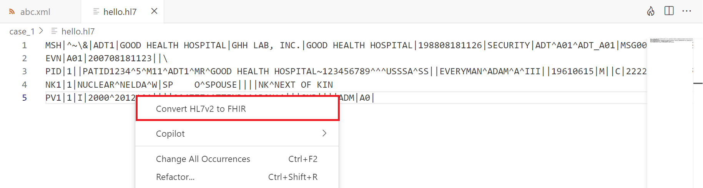
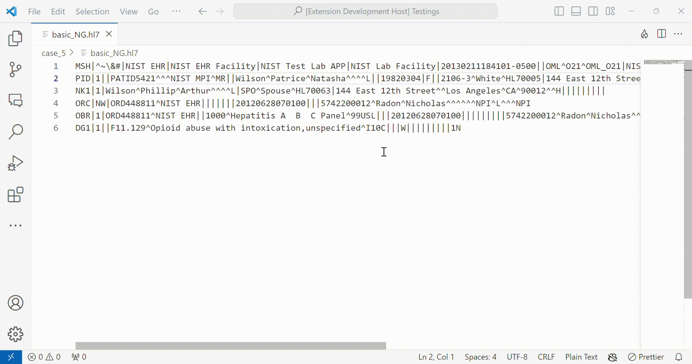
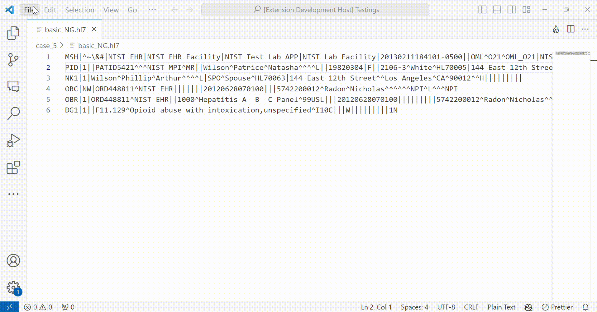

# Health Care VS Code extension

Explore developer tools for experimenting and learning foundational health IT concepts with our VS Code plugin.

| Features | Description | 
|---------| -----------|
|HL7v2 to FHIR transformation | Transforms HL7v2 messages to FHIR resources. Data transformation conditions are taken from the [official HL7v2 to FHIR mappings guide](https://build.fhir.org/ig/HL7/v2-to-fhir/) and based on the feedback received from the users. |
|C-CDA to FHIR transformation | Transforms C-CDA messages to FHIR resources. Data transformation conditions are taken from the [official C-CDA to FHIR mappings guide](https://hl7.org/fhir/us/ccda/2023May/) and based on the feedback received from the users. |

For added convenience, a hosted service offering the same functionality can be accessed through [fhirtools.io](https://fhirtools.io/). 

## Usage

### Data Transformation Feature

The extension gets activated on .txt, .h7, and .xml files. Once the extension is activated, it will detect the context of the file and verifies whether that is a HL7v2 message or C-CDA message. Upon identifying the message type, it will trigger the corresponding command.

1. Open a HL7 v2 message (either in a .txt file or .hl7 file) or an xml file containing C-CDA content.
2. Click the **Flame** icon to perform the conversion.
   

   **OR** 
   
   Right Click on the editor which has the content, to convert the message into a FHIR resource. Click the conversion command (“Convert HL7v2 to FHIR” or “Convert C-CDA to FHIR”) to perform the conversion.
   

3. Now, you can see the converted FHIR resource in a secondary panel. You have the option to download or copy the generated FHIR resource.

> [!NOTE]  
> ## Transformation with your personal services [OPTIONAL]
>
> This is an optional step. If you would like to host your own services and perform the conversion, you can follow the following steps to configure.
>
> 1. Host your HL7v2 to FHIR conversion service either [locally](https://github.com/wso2/open-healthcare-prebuilt-services/tree/main/transformation/v2-to-fhirr4-service#setup-and-run) or in [Choreo](https://github.com/wso2/open-healthcare-prebuilt-services/tree/main/transformation/v2-to-fhirr4-service#optional-deploy-in-choreo)
> 2. Host your C-CDA to FHIR conversion service either [locally](https://github.com/wso2/open-healthcare-prebuilt-services/blob/main/transformation/ccda-to-fhirr4-service/README.md#setup-and-run) or in [Choreo](https://github.com/wso2/open-healthcare-prebuilt-services/blob/main/transformation/ccda-to-fhirr4-service/README.md#optional-deploy-in-choreo)
> 3. Go to File->Preferences->Settings and on the search bar, search for **FHIR Tools**. There you can fill your hosted urls. 
> 
> 4. Securing your endpoints with Choreo OAuth credentials
>    - Create an application in Choreo Dev Portal
>    - Secure your applications with credentials
>    - Configure the following in the Extension settings
>       - Consumer Key
>       - Consumer Secrete
>       - Asgardeo Token Endpoint

## Feedback and support

We welcome your feedback and suggestions for improving the FHIR Tools VS Code extension. If you encounter any issues or have questions, [create a GitHub issue](https://github.com/wso2/fhir-tools-vscode/issues) to reach out to us.

Happy testing with FHIR Tools!
