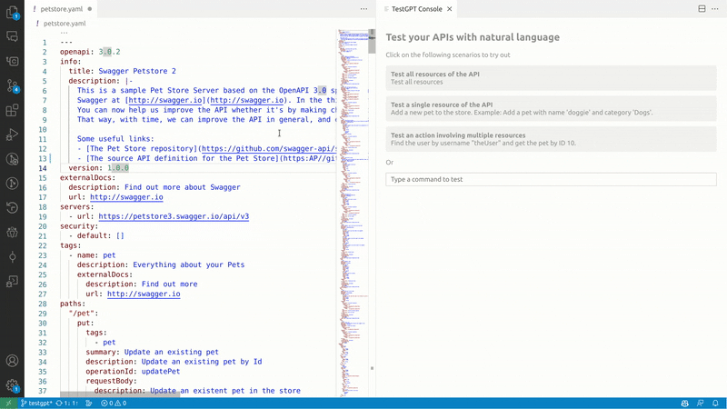
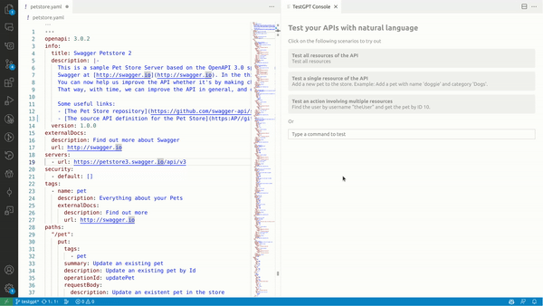
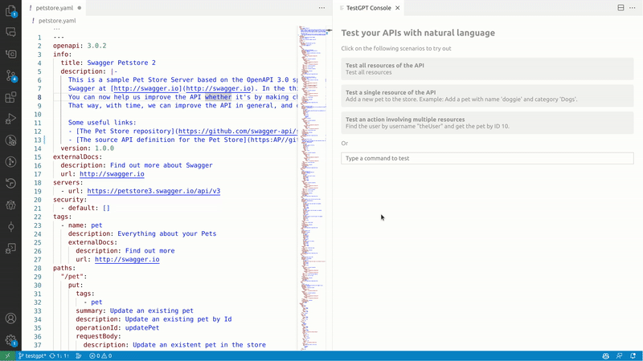
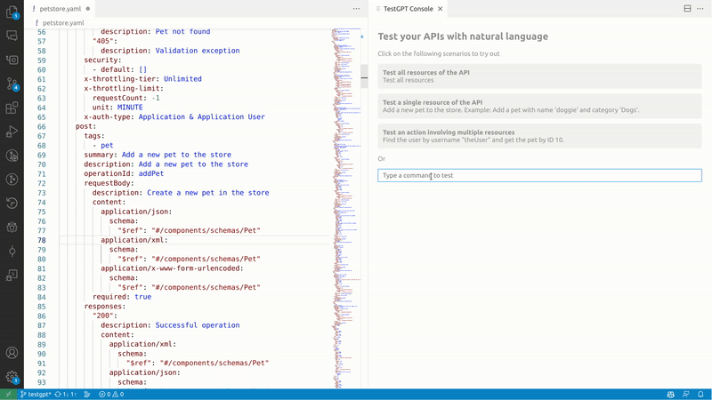

# TestGPT VSCode Extension

The TestGPT VS Code extension is a powerful tool that allows you to test APIs with OpenAPI descriptions using natural language and AI support. Whether you want to test all resources of an API, a single resource, an action involving multiple resources, or simply test by typing commands in natural language, TestGPT has you covered.

## Features

- **Test with Natural Language:** Simply type commands in natural language to interact with your API.
- **Test All Resources:** Easily test all the resources of your API to ensure they function as expected.
- **Test Single Resource:** Isolate and test a single resource to pinpoint issues quickly.
- **Test Complex Actions:** Test complex actions that involve multiple resources with ease.

## Getting Started

Follow these steps to set up and start using the TestGPT VS Code extension:

### Prerequisites

Before you begin, make sure you have the following prerequisites installed on your system:

1. [Visual Studio Code](https://code.visualstudio.com/download)
2. [TestGPT VS Code Extension](https://marketplace.visualstudio.com/items?itemName=WSO2.test-gpt) version 1.0.0 or later.

### Installation

1. Open Visual Studio Code.
2. Go to the Extensions view by clicking on the Extensions icon in the Activity Bar on the side of the window.
3. Search for "WSO2 TestGPT" in the Extensions view search box.
4. Click the Install button for the TestGPT extension.
5. Wait for the extension to be installed and activated.

### Usage

To get started with the TestGPT VS Code extension, follow these steps:

1. Open a Visual Studio Code workspace.

2. Open an OpenAPI YAML file in Visual Studio Code.

3. Use the following command to open the TestGPT Test Console:

    - Press `Ctrl+Shift+P` (Windows/Linux) or `Cmd+Shift+P` (Mac) to open the command palette.
    - Type `TestGPT: Open Test Console` and select it from the command list.

Now, you are ready to use TestGPT for testing your API using natural language and AI support. Here are some common use cases:

#### Test All Resources of the API

1. With the Test Console open, use the command `TestGPT: Test All Resources` to test all the resources of the API.

#### Test a Single Resource of the API

1. With the Test Console open, use the command `TestGPT: Test Single Resource` to test a specific resource by providing its name or path.

#### Test an Action Involving Multiple Resources

1. With the Test Console open, use the command `TestGPT: Test Complex Action` to test a complex action that involves multiple resources.

#### Test by Typing a Command in Natural Language

1. With the Test Console open, simply type your command in natural language, and TestGPT will understand and execute it.

## Feedback and Support

We welcome your feedback and suggestions for improving the TestGPT VS Code extension. If you encounter any issues or have questions, please [create a GitHub issue](https://github.com/wso2/choreo-vscode/issues) to reach out to us.

Happy testing with TestGPT!
